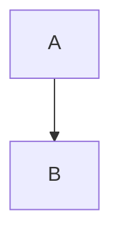
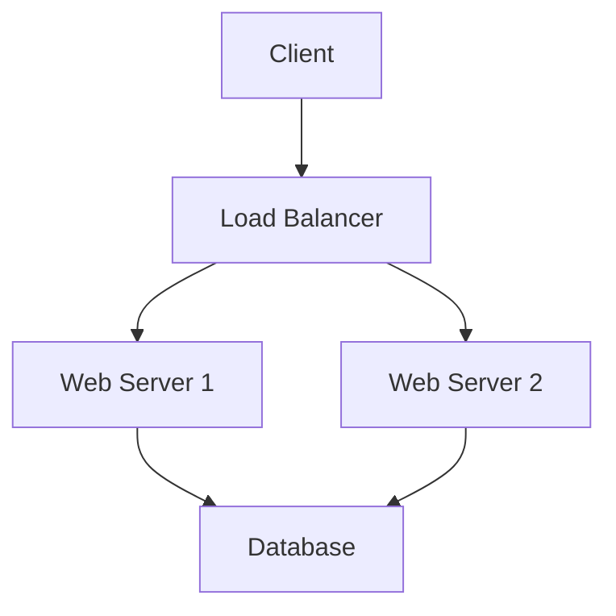

# Confluence Management Skill

> **Skill Type**: Project
> **Version**: 2.1.0
> **Description**: Comprehensive Confluence documentation management with support for downloading pages to Markdown, Wiki Markup conversion, diagram integration (Mermaid, PlantUML), page management via MCP tools and REST API, large document uploads, and comprehensive reference documentation for troubleshooting and best practices.

## Table of Contents

- [Overview](#overview)
- [⚠️ CRITICAL: MCP Size Limits](#-critical-mcp-size-limits)
- [Prerequisites](#prerequisites)
- [Core Capabilities](#core-capabilities)
- [Uploading Pages with Images (v2 Script)](#uploading-pages-with-images-v2-script)
- [Downloading Confluence Pages](#downloading-confluence-pages)
- [Workflow Guide](#workflow-guide)
- [Image Handling and Diagram Integration](#image-handling-and-diagram-integration)
- [Confluence Wiki Markup Reference](#confluence-wiki-markup-reference)
- [Markdown ↔ Wiki Markup Conversion](#markdown--wiki-markup-conversion)
- [Mermaid Diagram Integration](#mermaid-diagram-integration)
- [Using the mark Tool](#using-the-mark-tool)
- [Atlassian MCP Tools](#atlassian-mcp-tools)
- [CQL Search Best Practices](#cql-search-best-practices)
- [Common Workflows](#common-workflows)
- [Reference Documentation](#reference-documentation)
- [Troubleshooting](#troubleshooting)

## Overview

This skill provides comprehensive Confluence documentation management capabilities through Claude Code. It combines:

- **Page Downloader**: Download Confluence pages to Markdown with full hierarchy and macro conversion
- **Page Uploader (v2)**: Upload large documents with images via REST API (no size limits)
- **Atlassian MCP Integration**: Direct Confluence API access for reading pages and metadata
- **Wiki Markup Expertise**: Full support for Confluence Wiki Markup syntax
- **Markdown Support**: Bidirectional conversion between Markdown and Wiki Markup
- **Diagram Integration**: Mermaid and PlantUML diagram support via companion skills
- **Image Handling**: Comprehensive support for regular images, diagrams, and screenshots
- **mark CLI Integration**: Synchronize Markdown files from Git repositories to Confluence
- **Advanced Search**: CQL (Confluence Query Language) queries for precise content discovery
- **Reference Documentation**: Complete guides for storage format, image handling, and troubleshooting

## ⚠️ CRITICAL: MCP Size Limits

**DO NOT USE MCP FOR CONFLUENCE PAGE UPLOADS!**

MCP tools have size limits (typically 10-20KB) and **cannot** upload large documents or pages with multiple images.

### ❌ DO NOT USE for Page Uploads:
- `mcp__atlassian-evinova__confluence_update_page` - Size limited
- `mcp__atlassian-evinova__confluence_create_page` - Size limited

### ✅ USE INSTEAD:
- `scripts/upload_confluence_v2.py` - No size limits, handles large documents with images

**Why This Matters:**
- MCP works fine for **reading** pages
- MCP **fails** for **uploading** pages > 10-20KB
- Large documents with images typically exceed MCP limits
- REST API via upload script has no practical size limits

**Example:**
```bash
# ❌ DON'T: Use MCP for uploads
# mcp__atlassian-evinova__confluence_update_page(...)

# ✅ DO: Use upload script
python3 ~/.claude/skills/confluence/scripts/upload_confluence_v2.py \
    document.md --id 780369923
```

**See:** [Reference Documentation](#reference-documentation) for complete upload workflows.

## Prerequisites

### Required MCP Server

- **Atlassian MCP Server** (`mcp__atlassian-evinova`) must be configured with:
  - Confluence instance URL
  - Valid authentication credentials (API token or OAuth)
  - Appropriate permissions for the spaces you want to manage

### Optional Tools

- **mark CLI**: For Git-to-Confluence synchronization
  ```bash
  # Install via Homebrew
  brew install kovetskiy/mark/mark

  # Or via Go
  go install github.com/kovetskiy/mark@latest
  ```

- **Mermaid CLI**: For local diagram rendering
  ```bash
  npm install -g @mermaid-js/mermaid-cli
  ```

- **Node.js packages** (for advanced conversion):
  ```bash
  npm install -g markdown2confluence
  ```

## Core Capabilities

### 1. Page Downloading (NEW)
- ✅ Download Confluence pages to clean Markdown files
- ✅ Convert Confluence macros (code blocks, children lists, images)
- ✅ Download attachments with localized links
- ✅ Hierarchical child page downloads to subdirectories
- ✅ YAML frontmatter with complete page metadata
- ✅ HTML debugging mode for troubleshooting
- ✅ Retry logic with exponential backoff

### 2. Page Management
- ✅ Search Confluence using natural language or CQL
- ✅ Retrieve page content (with or without metadata)
- ✅ Create new pages with proper hierarchy
- ✅ Update existing pages
- ✅ Delete pages (with confirmation)
- ✅ Manage page labels
- ✅ Handle attachments
- ✅ Get page children and hierarchy

### 3. Format Conversion
- ✅ Markdown → Confluence Wiki Markup
- ✅ Confluence Wiki Markup → Markdown
- ✅ Mermaid diagrams → PNG/SVG images
- ✅ Preserve formatting during conversion
- ✅ Handle edge cases and special characters

### 4. Diagram Support
- ✅ Render Mermaid diagrams to images
- ✅ Upload diagram images to Confluence
- ✅ Embed diagrams in pages
- ✅ Support multiple diagram formats (PNG, SVG)

### 5. Batch Operations
- ✅ Bulk page creation
- ✅ Mass updates from Markdown files
- ✅ Synchronized documentation from Git repositories
- ✅ Template-based page generation

### 6. Image and Diagram Handling (NEW in v2.1.0)
- ✅ Upload pages with regular images (PNG, JPG, SVG, GIF)
- ✅ Mermaid diagram integration via `design-doc-mermaid` skill
- ✅ PlantUML diagram integration via `plantuml` skill
- ✅ Automatic image attachment handling
- ✅ Skip re-uploading existing attachments
- ✅ Proper HTML escaping prevention (images render correctly)
- ✅ No size limits for page uploads (REST API)
- ✅ Support for large documents (> 1MB)

### 7. Reference Documentation (NEW in v2.1.0)
- ✅ Complete Confluence storage format guide
- ✅ Image handling best practices
- ✅ Comprehensive troubleshooting guide
- ✅ Common errors and solutions
- ✅ Integration with diagram skills

## Uploading Pages with Images (v2 Script)

**Use Case:** Upload large Markdown documents with images (screenshots, diagrams, etc.) to Confluence without size limits.

### Why v2 Script?

The `upload_confluence_v2.py` script was created to solve critical issues:

1. **MCP Size Limits** - MCP cannot handle large documents
2. **Image HTML Escaping** - Raw XML in markdown appeared as literal text
3. **Attachment Handling** - `MermaidConfluenceRenderer` broke regular images
4. **Large Documents** - Need to upload 1000+ line documents with multiple images

### Quick Start

**1. Prepare Your Document**

Create markdown with standard image syntax:

```markdown
# Technical Architecture

## Overview

This document describes our system architecture.

## Architecture Diagram


*Figure 1: System Architecture*

## Screenshots


```

**2. Prepare Images**

If using Mermaid or PlantUML diagrams, convert them to PNG/SVG first:

```bash
# Option A: Use design-doc-mermaid skill
Skill: "design-doc-mermaid"
# Follow prompts to convert Mermaid diagrams

# Option B: Use plantuml skill
Skill: "plantuml"
# Follow prompts to convert PlantUML diagrams

# Option C: Manual conversion
mmdc -i architecture.mmd -o architecture.png -b transparent
plantuml deployment.puml -tpng
```

**3. Upload to Confluence**

```bash
# Update existing page
python3 ~/.claude/skills/confluence/scripts/upload_confluence_v2.py \
    document.md --id 780369923

# Create new page
python3 ~/.claude/skills/confluence/scripts/upload_confluence_v2.py \
    document.md --space ARCP --parent-id 123456

# Dry-run (preview without uploading)
python3 ~/.claude/skills/confluence/scripts/upload_confluence_v2.py \
    document.md --id 780369923 --dry-run

# Use custom credentials file
python3 ~/.claude/skills/confluence/scripts/upload_confluence_v2.py \
    document.md --id 780369923 --env-file /path/to/.env.jira
```

### What Happens During Upload

1. **Parse Markdown** - Reads file, extracts frontmatter and title
2. **Convert to Storage Format** - Uses md2cf's base `ConfluenceRenderer`
3. **Detect Images** - Finds all `` references
4. **Upload Page Content** - Updates/creates page via REST API
5. **Upload Attachments** - Uploads image files (skips if already exist)
6. **Verify Success** - Returns page URL and version number

### Key Features

**✅ Correct Image Handling:**
- Uses markdown image syntax: ``
- md2cf converts to proper Confluence storage format
- Images render correctly (not as literal text)

**✅ Smart Attachment Upload:**
- Checks if attachment already exists before uploading
- Skips re-upload by default (use `--force-reupload` to override)
- Supports PNG, JPG, SVG, GIF, PDF formats

**✅ No Size Limits:**
- Bypasses MCP entirely
- Uses REST API directly
- Handles documents > 1MB easily
- Tested with 1300+ line documents

**✅ Error Handling:**
- Clear error messages
- Validates file paths before upload
- Checks page permissions
- Reports upload progress

### Common Patterns

**Pattern 1: Technical Document with Diagrams**

```bash
# 1. Create markdown with Mermaid/PlantUML code
# 2. Convert diagrams to images using appropriate skill
Skill: "design-doc-mermaid"  # or "plantuml"

# 3. Update markdown to reference generated images
# 

# 4. Upload to Confluence
python3 ~/.claude/skills/confluence/scripts/upload_confluence_v2.py \
    technical-doc.md --id 780369923
```

**Pattern 2: Documentation with Screenshots**

```bash
# 1. Create markdown with image references
# 

# 2. Upload directly (images already exist)
python3 ~/.claude/skills/confluence/scripts/upload_confluence_v2.py \
    user-guide.md --id 456789
```

**Pattern 3: Large Multi-Section Document**

```bash
# Works with large documents (> 500KB)
python3 ~/.claude/skills/confluence/scripts/upload_confluence_v2.py \
    comprehensive-guide.md --id 123456
```

### Differences from v1 Script

| Feature | v1 (`upload_confluence.py`) | v2 (`upload_confluence_v2.py`) |
|---------|----------------------------|-------------------------------|
| **Renderer** | MermaidConfluenceRenderer | Base ConfluenceRenderer |
| **Regular Images** | ❌ Broken (attachments list overwritten) | ✅ Works correctly |
| **Mermaid Support** | ✅ Built-in (but breaks images) | Convert to PNG first |
| **PlantUML Support** | ❌ Not supported | Convert to PNG first |
| **Error Handling** | ⚠️  Basic | ✅ Comprehensive |
| **Large Documents** | ⚠️  May fail | ✅ Tested with 1MB+ |
| **Skip Existing Attachments** | ❌ No | ✅ Yes (default) |
| **HTML Escaping Issue** | ❌ Possible | ✅ Fixed |

**Recommendation:** Use v2 for all new work. v1 remains for backward compatibility only.

## Image Handling and Diagram Integration

### Overview

The confluence skill integrates with diagram generation skills to provide comprehensive image and diagram support:

- **design-doc-mermaid skill** - Mermaid diagram conversion
- **plantuml skill** - PlantUML diagram conversion
- **Regular images** - PNG, JPG, SVG, GIF support

### The Correct Workflow

**Step 1: Convert Diagrams to Images (If Needed)**

```bash
# For Mermaid diagrams
Skill: "design-doc-mermaid"
# Converts ```mermaid blocks to PNG/SVG files

# For PlantUML diagrams
Skill: "plantuml"
# Converts .puml files to PNG/SVG files
```

**Step 2: Reference Images in Markdown**

Use standard markdown image syntax:

```markdown
# ✅ CORRECT - Standard markdown syntax


# ❌ WRONG - Don't use raw Confluence XML
<ac:image><ri:attachment ri:filename="diagram.png"/></ac:image>

# ❌ WRONG - Don't use Mermaid code blocks directly

```

**Step 3: Upload to Confluence**

```bash
python3 ~/.claude/skills/confluence/scripts/upload_confluence_v2.py \
    document.md --id 780369923
```

### Why This Approach?

**Problem with MermaidConfluenceRenderer:**
- Overwrites parent's `attachments` attribute
- Uses dict format instead of string paths
- Breaks regular markdown image detection
- Causes "string indices must be integers" errors

**Solution:**
1. Convert diagrams to images separately (using diagram skills)
2. Use base `ConfluenceRenderer` (not `MermaidConfluenceRenderer`)
3. Reference all images (diagrams + regular) with markdown syntax
4. Upload everything together

### HTML Escaping Issue (CRITICAL)

**Problem:**
If you put raw Confluence XML in markdown:
```markdown
<ac:image><ri:attachment ri:filename="diagram.png"/></ac:image>
```

md2cf HTML-escapes it:
```
&lt;ac:image&gt;&lt;ri:attachment ri:filename="diagram.png"/&gt;&lt;/ac:image&gt;
```

Result: Text appears literally on Confluence page.

**Solution:**
Always use markdown syntax:
```markdown

```

md2cf converts to proper storage format:
```xml
<ac:image ac:alt="Diagram">
  <ri:attachment ri:filename="diagram.png"/>
</ac:image>
```

### Integration with Diagram Skills

**Using design-doc-mermaid:**

```bash
# 1. Invoke skill
Skill: "design-doc-mermaid"

# 2. Provide Mermaid diagram code when prompted

# 3. Skill generates PNG/SVG files

# 4. Reference in markdown


# 5. Upload with confluence skill
python3 ~/.claude/skills/confluence/scripts/upload_confluence_v2.py \
    document.md --id 780369923
```

**Using plantuml:**

```bash
# 1. Invoke skill
Skill: "plantuml"

# 2. Provide PlantUML code when prompted

# 3. Skill generates PNG/SVG files

# 4. Reference in markdown


# 5. Upload with confluence skill
python3 ~/.claude/skills/confluence/scripts/upload_confluence_v2.py \
    document.md --id 780369923
```

### File Size Recommendations

- **PNG Screenshots:** < 500KB (optimize with pngquant if needed)
- **PNG Diagrams:** Usually < 100KB
- **SVG Diagrams:** < 50KB (preferred for diagrams)
- **JPG Photos:** < 1MB at 80-85% quality

## Downloading Confluence Pages

The skill includes a powerful downloader script (`scripts/download_confluence.py`) for converting Confluence pages to clean Markdown files.

### Quick Start

**1. Setup credentials**

Create a `.env` file (see `examples/.env.example`):
```bash
CONFLUENCE_URL=https://yourcompany.atlassian.net
CONFLUENCE_USERNAME=your.email@company.com
CONFLUENCE_API_TOKEN=your_api_token
```

Get API Token: https://id.atlassian.com/manage-profile/security/api-tokens

**2. Find page IDs**

Page IDs are in the URL:
```
https://yourcompany.atlassian.net/wiki/spaces/SPACE/pages/123456789/Page+Title
                                                                    ^^^^^^^^^
                                                                    Page ID
```

**3. Download pages**

```bash
# Single page
python3 ~/.claude/skills/confluence/scripts/download_confluence.py 123456789

# Multiple pages
python3 ~/.claude/skills/confluence/scripts/download_confluence.py 123456 456789 789012

# From file
python3 ~/.claude/skills/confluence/scripts/download_confluence.py --page-ids-file page_ids.txt

# With child pages in subdirectories
python3 ~/.claude/skills/confluence/scripts/download_confluence.py --download-children 123456789

# With HTML debugging
python3 ~/.claude/skills/confluence/scripts/download_confluence.py --save-html 123456789

# Custom output directory
python3 ~/.claude/skills/confluence/scripts/download_confluence.py --output-dir ./docs 123456789

# Custom .env file
python3 ~/.claude/skills/confluence/scripts/download_confluence.py --env-file /path/to/.env 123456789
```

### Macro Transformations

The downloader automatically converts Confluence macros:

**Children Macro**
- Confluence: `{children}` macro displays dynamic list of child pages
- Markdown: Converted to static bullet list with child page names

**Code Macro**
- Confluence: `{code:language=python}...{code}` with CDATA
- Markdown: Proper fenced code blocks with language: ` ```python `

**Image Macro**
- Confluence: `<ac:image><ri:attachment ri:filename="diagram.png"/></ac:image>`
- Markdown: `` with downloaded file

### Output Structure

**Flat Structure (default)**
```
confluence_docs/
  Page_1.md
  Page_1_attachments/
    image1.png
  Page_2.md
```

**Hierarchical Structure (--download-children)**
```
confluence_docs/
  Parent_Page.md
  Parent_Page_attachments/
    parent_image.png
  Parent_Page_Children/
    Child_Page_1.md
    Child_Page_1_attachments/
      child_image.png
    Child_Page_2.md
```

### Frontmatter Example

```yaml
---
title: My Confluence Page
confluence_url: https://company.atlassian.net/wiki/spaces/SPACE/pages/123456789
confluence:
  id: '123456789'
  space: SPACE
  version: 5
  type: page
  labels:
    - documentation
    - api
breadcrumb:
  - id: '111111'
    title: Space Home
  - id: '222222'
    title: Section
  - id: '123456789'
    title: My Confluence Page
parent:
  id: '222222'
  title: Section
  file: ../Section.md
children:
  - id: '333333'
    title: Child Page
    file: My_Confluence_Page_Children/Child_Page.md
attachments:
  - id: '444444'
    title: diagram.png
    media_type: image/png
    file_size: 125000
exported_at: '2025-11-06 12:00:00'
exported_by: confluence_downloader
---
```

### Troubleshooting Downloads

**Missing Content**
- Use `--save-html` to save intermediate HTML files in `_html_debug/`:
  - `original_{page}.html` - Raw HTML from API
  - `formatted_{page}.html` - Pretty-printed HTML
  - `transformed_{page}.html` - After macro transformations
  - `original_{page}.md` - Before post-processing

**Authentication Errors**
- Verify CONFLUENCE_URL includes the full domain
- Check API token is valid (regenerate if needed)
- Ensure username is exact email address

**Empty Pages**
- Some pages only contain macros that render dynamically
- The downloader converts these to static content

### Dependencies

Install with:
```bash
pip3 install -r ~/.claude/skills/confluence/scripts/requirements.txt
```

Required packages:
- requests>=2.31.0
- python-dotenv>=1.0.0
- PyYAML>=6.0.1
- markdownify>=0.11.6
- beautifulsoup4>=4.12.0

## Workflow Guide

### Quick Start: Creating a Confluence Page

```markdown
User: "Create a Confluence page in the DEV space titled 'API Documentation' with a simple overview"

Assistant workflow:
1. Use mcp__atlassian-evinova__confluence_create_page
2. Provide space_key="DEV", title="API Documentation"
3. Convert Markdown content to Wiki Markup
4. Set parent_id if specified
5. Add labels if requested
6. Return page URL and ID
```

### Quick Start: Searching Confluence

```markdown
User: "Find all pages about 'authentication' in the DEV space created this year"

Assistant workflow:
1. Use mcp__atlassian-evinova__confluence_search
2. Build CQL: 'space = "DEV" AND text ~ "authentication" AND created >= startOfYear()'
3. Return results with page titles, IDs, and URLs
4. Optionally fetch full content if requested
```

### Quick Start: Converting Markdown with Diagrams

```markdown
User: "Convert this Markdown document with diagrams to Confluence"

Assistant workflow:
1. **Check for PlantUML diagrams FIRST**:
   - Look for ```puml or ```plantuml code blocks
   - Look for  image links to .puml files
   - **If PlantUML diagrams found** → **STOP and invoke PlantUML skill FIRST**:
     - Path: `/Users/richardhightower/.claude/skills/plantuml`
     - Action: Convert diagrams to images using PlantUML skill's markdown processing workflow
     - Script: `python scripts/process_markdown_puml.py <file.md> --format png`
     - Result: Creates `<file>_with_images.md` with diagrams converted to `` references
     - **Use the transformed markdown** for Confluence upload
   - **Reason**: Confluence does not natively render PlantUML code blocks
2. **Check for Mermaid diagrams** (if no PlantUML found):
   - Extract Mermaid diagram blocks
   - Render each diagram to PNG using mermaid-cli (mmdc command)
3. Parse remaining Markdown content
4. **IMPORTANT**: The Atlassian MCP does NOT support attachment uploads directly
5. **Two Options for Diagram Upload**:
   **Option A (Recommended)**: Use mark CLI tool which handles attachments:
      - Save markdown file with metadata comments
      - Use mark CLI to publish (includes attachment upload)
   **Option B**: Embed as Base64 data URLs in HTML img tags:
      - Convert PNG to base64
      - Embed in page content as ``
      - Note: Large images may hit size limits
6. Create or update Confluence page with diagram references
7. Return success with page URL

**CRITICAL**: Always check for PlantUML diagrams first and convert them using the PlantUML skill before proceeding.
Always use mark CLI for production workflows with diagrams.
The MCP tools are best for simple text-only pages.
```

## Confluence Wiki Markup Reference

### Text Formatting

| Element | Syntax | Example Output |
|---------|--------|----------------|
| Bold | `*bold text*` | **bold text** |
| Italic | `_italic text_` | *italic text* |
| Strikethrough | `-strikethrough-` | ~~strikethrough~~ |
| Monospace | `{{monospace}}` | `monospace` |
| Superscript | `^superscript^` | text^super^ |
| Subscript | `~subscript~` | text~sub~ |

### Headings

```wiki
h1. Heading Level 1
h2. Heading Level 2
h3. Heading Level 3
h4. Heading Level 4
h5. Heading Level 5
h6. Heading Level 6
```

### Lists

**Unordered List:**
```wiki
* Item 1
* Item 2
** Sub-item 2.1
** Sub-item 2.2
*** Deep sub-item 2.2.1
* Item 3
```

**Ordered List:**
```wiki
# Step 1
# Step 2
## Sub-step 2.1
## Sub-step 2.2
# Step 3
```

**Mixed Lists:**
```wiki
# Ordered item 1
#* Unordered sub-item
#* Another unordered sub-item
# Ordered item 2
```

### Links

**Internal Page Link:**
```wiki
[Page Title]
[Custom Text|Page Title]
```

**External Link:**
```wiki
[http://example.com]
[Link Text|http://example.com]
```

**Anchor Link:**
```wiki
{anchor:myanchor}
[Jump to anchor|#myanchor]
```

**Attachment Link:**
```wiki
[^filename.pdf]
[Download|^filename.pdf]
```

### Tables

```wiki
||Header 1||Header 2||Header 3||
|Cell 1.1|Cell 1.2|Cell 1.3|
|Cell 2.1|Cell 2.2|Cell 2.3|
```

**Table with alignment and spanning:**
```wiki
||Heading 1||Heading 2||
|Left aligned text|Right aligned text|
|Center aligned|Merged columns||
```

### Code Blocks

**Inline Code:**
```wiki
Use the {{code}} tag for inline code.
```

**Code Block:**
```wiki
{code:title=Example.java|theme=Emacs|linenumbers=true|language=java}
public class Example {
    public static void main(String[] args) {
        System.out.println("Hello, Confluence!");
    }
}
{code}
```

**Supported languages:** java, python, javascript, xml, sql, bash, json, yaml, and many more.

### Macros

**Panel:**
```wiki
{panel:title=Important Information|borderStyle=solid|borderColor=#ccc|titleBGColor=#F7D6C1|bgColor=#FFFFCE}
This is important content in a panel.
{panel}
```

**Info, Tip, Note, Warning:**
```wiki
{info}
This is an informational message.
{info}

{tip}
This is a helpful tip.
{tip}

{note}
This is a note.
{note}

{warning}
This is a warning message.
{warning}
```

**Quote:**
```wiki
{quote}
This is a block quote.
It can span multiple lines.
{quote}
```

**Code Block:**
```wiki
{code:language=python|title=example.py|collapse=true}
def hello():
    print("Hello, World!")
{code}
```

**Expand:**
```wiki
{expand:title=Click to expand}
This content is hidden until the user clicks.
{expand}
```

**Table of Contents:**
```wiki
{toc}
{toc:maxLevel=3|minLevel=2}
```

**Include Page:**
```wiki
{include:Space:Page Title}
```

**Excerpt:**
```wiki
{excerpt}
This text can be referenced from other pages.
{excerpt}
```

### Images

**Embedded Image:**
```wiki
!image.png!
!http://example.com/image.png!
```

**With Attributes:**
```wiki
!image.png|thumbnail!
!image.png|width=300!
!image.png|align=center!
!image.png|alt=Description!
```

**Image with Link:**
```wiki
!image.png|thumbnail!
[View Full Size|^image.png]
```

### Special Characters and Emoticons

```wiki
:)   - Smiley
:(   - Sad
:D   - Big grin
;)   - Wink
(/)  - Checkmark
(x)  - Cross
(!)  - Warning
(?)  - Question
(+)  - Plus
(-)  - Minus
(i)  - Info
```

### Advanced Formatting

**Colored Text:**
```wiki
{color:red}This text is red{color}
{color:#0000FF}This text is blue{color}
```

**Horizontal Rule:**
```wiki
----
```

**Blockquote:**
```wiki
bq. This is a blockquote.
```

**No Format:**
```wiki
{noformat}
This text will be displayed exactly as typed,
  preserving   spacing and line breaks.
{noformat}
```

## Markdown ↔ Wiki Markup Conversion

### Conversion Matrix

| Element | Markdown | Wiki Markup |
|---------|----------|-------------|
| H1 | `# Heading` | `h1. Heading` |
| H2 | `## Heading` | `h2. Heading` |
| Bold | `**bold**` | `*bold*` |
| Italic | `*italic*` | `_italic_` |
| Strikethrough | `~~strike~~` | `-strike-` |
| Code inline | `` `code` `` | `{{code}}` |
| Code block | ` ```language` | `{code:language=language}` |
| Unordered list | `- item` | `* item` |
| Ordered list | `1. item` | `# item` |
| Link | `[text](url)` | `[text\|url]` |
| Image | `` | `!url!` |
| Table header | `\| Header \|` | `\|\|Header\|\|` |
| Table cell | `\| Cell \|` | `\|Cell\|` |
| Blockquote | `> quote` | `bq. quote` |
| HR | `---` | `----` |

### Conversion Script

See `scripts/convert_markdown_to_wiki.py` for automated conversion with the following features:

- Preserves inline formatting
- Handles nested lists
- Converts tables with proper alignment
- Processes code blocks with language hints
- Converts Mermaid diagrams to image references
- Handles edge cases and special characters

### Limitations

**Markdown → Wiki Markup:**
- Some advanced Markdown extensions not supported (footnotes, definition lists)
- GitHub-flavored Markdown task lists need manual conversion
- Complex nested formatting may require manual review
- Some HTML embedded in Markdown won't translate

**Wiki Markup → Markdown:**
- Confluence macros have no Markdown equivalent (converted to HTML or placeholders)
- Panel colors and advanced styling lost
- Some table features (merged cells, alignment) may need adjustment
- Emoticon shortcuts become Unicode or images

## Mermaid Diagram Integration

### Supported Diagram Types

- Flowcharts
- Sequence diagrams
- Class diagrams
- State diagrams
- Entity Relationship diagrams
- Gantt charts
- Pie charts
- Git graphs
- User journey maps

### Best Practices for Diagram Rendering

**CRITICAL - Image Verification Protocol:**
1. **Always verify images are created** before publishing to Confluence
2. **Check file existence**: `ls -lh diagram.svg` or `test -f diagram.svg`
3. **Verify file validity**: `file diagram.svg` should show "SVG Scalable Vector Graphics image"
4. **Check file size**: Ensure non-zero size (empty files indicate rendering failure)

**Text Color Guidelines:**
- **Light backgrounds (pastels)**: Use dark text (#000000) for maximum readability
- **Dark backgrounds**: Use light text (#FFFFFF or pastels)
- **When in doubt**: Default to light backgrounds with black text
- **Example theme for light backgrounds**:
  ```javascript
  %%{init: {'theme':'base', 'themeVariables': {
    'primaryTextColor':'#000000',
    'secondaryTextColor':'#000000',
    'tertiaryTextColor':'#000000',
    'textColor':'#000000',
    'lineColor':'#000000',
    'mainBkg':'#ffffff',
    'secondBkg':'#f8fafc'
  }}}%%
  ```

**Format Selection Guidelines:**
- **SVG (preferred)**: For simple diagrams (flowcharts, sequences, state machines)
  - Scalable without quality loss
  - Smaller file size for simple diagrams
  - Renders well in modern browsers
- **PNG (fallback)**: For complex diagrams (ERDs with many entities)
  - Better Confluence compatibility for complex graphics
  - Use high resolution: `-w 1200 -H 1600` for quality
  - File size typically >100KB indicates complexity requiring PNG

### Workflow: Mermaid → Confluence

**Option 1: Using Mermaid CLI (Recommended)**

```bash
# Install mermaid-cli
npm install -g @mermaid-js/mermaid-cli

# Convert Mermaid to PNG with white background
mmdc -i diagram.mmd -o diagram.png -b white -w 1200 -H 1600

# Convert Mermaid to SVG with transparent background
mmdc -i diagram.mmd -o diagram.svg -b transparent

# IMPORTANT: Always verify image was created successfully
test -f diagram.svg && echo "✅ SVG created" || echo "❌ SVG failed"
file diagram.svg  # Should show: "SVG Scalable Vector Graphics image"
ls -lh diagram.svg  # Verify non-zero size
```

**Option 2: Using Python Script**

See `scripts/render_mermaid.py` which:
1. Uses headless browser (Puppeteer/Playwright)
2. Renders Mermaid diagram
3. Captures as PNG or SVG
4. Returns image file path

**Option 3: Using Confluence Plugins**

If available in your Confluence instance:
- **Capable Diagrams for Confluence**: Native Mermaid support
- **Mermaid Integration for Confluence**: Live editor
- **draw.io for Confluence**: Import Mermaid via Advanced menu

### Example Workflow

```python
# User provides Markdown with Mermaid
markdown_content = """
# System Architecture



More content here...
"""

# Assistant workflow:
# 1. Extract Mermaid code blocks
# 2. Render to PNG using scripts/render_mermaid.py
# 3. Upload PNG to Confluence page as attachment
# 4. Replace Mermaid block with image reference
# 5. Convert remaining Markdown to Wiki Markup
# 6. Create/update page
```

### Diagram Embedding

After uploading image as attachment:

```wiki
!diagram-architecture.png|width=600,align=center!

h3. Figure 1: System Architecture Diagram
```

## Using the mark Tool

### What is mark?

`mark` is a CLI tool that syncs Markdown files to Confluence pages, ideal for:
- Documentation-as-Code workflows
- CI/CD integration
- Git-based documentation management
- Bulk page synchronization

### Installation

```bash
# Homebrew (macOS)
brew install kovetskiy/mark/mark

# Go
go install github.com/kovetskiy/mark@latest

# Docker
docker pull kovetskiy/mark

# Direct download
curl -LO https://github.com/kovetskiy/mark/releases/latest/download/mark
chmod +x mark
sudo mv mark /usr/local/bin/
```

### Configuration

Create `~/.config/mark`:

```toml
username = "your-email@example.com"
password = "your-api-token"
base_url = "https://your-instance.atlassian.net/wiki"

# Optional: default space
space = "DEV"
```

### Markdown Metadata

Add metadata to your Markdown files using HTML comments:

```markdown
<!-- Space: DEV -->
<!-- Parent: API Documentation -->
<!-- Title: Authentication Guide -->
<!-- Attachment: diagrams/auth-flow.png -->
<!-- Label: api -->
<!-- Label: authentication -->
<!-- Label: security -->

# Authentication Guide

Content goes here...
```

### Usage Examples

**Basic sync:**
```bash
mark -f README.md
```

**Specify credentials:**
```bash
mark -u user@example.com -p api-token -f documentation.md
```

**Dry run (preview):**
```bash
mark --dry-run -f documentation.md
```

**With config file:**
```bash
mark -c ~/.config/mark-prod -f documentation.md
```

**CI/CD Integration (GitHub Actions):**
```yaml
name: Sync to Confluence

on:
  push:
    paths:
      - 'docs/**/*.md'
    branches:
      - main

jobs:
  sync:
    runs-on: ubuntu-latest
    steps:
      - uses: actions/checkout@v3

      - name: Install mark
        run: |
          curl -LO https://github.com/kovetskiy/mark/releases/latest/download/mark
          chmod +x mark
          sudo mv mark /usr/local/bin/

      - name: Sync to Confluence
        env:
          CONFLUENCE_USERNAME: ${{ secrets.CONFLUENCE_USERNAME }}
          CONFLUENCE_PASSWORD: ${{ secrets.CONFLUENCE_API_TOKEN }}
          CONFLUENCE_BASE_URL: ${{ secrets.CONFLUENCE_BASE_URL }}
        run: |
          for file in docs/**/*.md; do
            mark -u "$CONFLUENCE_USERNAME" \
                 -p "$CONFLUENCE_PASSWORD" \
                 --base-url "$CONFLUENCE_BASE_URL" \
                 -f "$file"
          done
```

### Best Practices

1. **Use consistent metadata**: Always include Space, Title, and optionally Parent
2. **Version control everything**: Keep Markdown files in Git
3. **Automate syncing**: Use CI/CD to sync on commits
4. **Test with dry-run**: Always preview before actual sync
5. **Handle attachments**: Reference local files for diagrams/images
6. **Use labels**: Organize pages with consistent labeling
7. **Parent hierarchy**: Set up proper page hierarchies for navigation

### Limitations

- Does NOT delete pages when Markdown files are removed
- Cannot sync bidirectionally (Confluence → Markdown)
- Attachment updates may require manual cleanup
- Some Wiki Markup features not supported in Markdown source

## Atlassian MCP Tools

### Available Confluence Tools

#### confluence_search
Search Confluence using CQL or simple text.

```javascript
mcp__atlassian-evinova__confluence_search({
  query: "space = 'DEV' AND type = page AND created >= startOfYear()",
  limit: 10,
  spaces_filter: "DEV,PROJ"
})
```

#### confluence_get_page
Retrieve a specific page by ID or by title and space.

```javascript
// By page ID
mcp__atlassian-evinova__confluence_get_page({
  page_id: "123456789",
  include_metadata: true,
  convert_to_markdown: true
})

// By title and space
mcp__atlassian-evinova__confluence_get_page({
  title: "API Documentation",
  space_key: "DEV",
  include_metadata: true,
  convert_to_markdown: false  // Get Wiki Markup
})
```

#### confluence_create_page
Create a new Confluence page.

```javascript
mcp__atlassian-evinova__confluence_create_page({
  space_key: "DEV",
  title: "New API Endpoint Documentation",
  content: "h1. Overview\n\nContent here...",
  parent_id: "123456",  // Optional
  content_format: "wiki",  // or "markdown" or "storage"
  enable_heading_anchors: false
})
```

#### confluence_update_page
Update an existing page.

```javascript
mcp__atlassian-evinova__confluence_update_page({
  page_id: "123456789",
  title: "Updated Title",
  content: "h1. New Content\n\nUpdated information...",
  is_minor_edit: false,
  version_comment: "Updated with new API endpoints",
  content_format: "wiki"
})
```

#### confluence_delete_page
Delete a page (use with caution).

```javascript
mcp__atlassian-evinova__confluence_delete_page({
  page_id: "123456789"
})
```

#### confluence_get_page_children
Get child pages of a parent page.

```javascript
mcp__atlassian-evinova__confluence_get_page_children({
  parent_id: "123456789",
  expand: "version",
  limit: 25,
  include_content: true,
  convert_to_markdown: true
})
```

#### confluence_add_label
Add a label to a page.

```javascript
mcp__atlassian-evinova__confluence_add_label({
  page_id: "123456789",
  name: "api-documentation"
})
```

#### confluence_get_labels
Get all labels for a page.

```javascript
mcp__atlassian-evinova__confluence_get_labels({
  page_id: "123456789"
})
```

#### confluence_add_comment
Add a comment to a page.

```javascript
mcp__atlassian-evinova__confluence_add_comment({
  page_id: "123456789",
  content: "This needs to be updated with the latest API changes."
})
```

#### confluence_get_comments
Retrieve all comments on a page.

```javascript
mcp__atlassian-evinova__confluence_get_comments({
  page_id: "123456789"
})
```

#### confluence_search_user
Search for Confluence users.

```javascript
mcp__atlassian-evinova__confluence_search_user({
  query: 'user.fullname ~ "John Doe"',
  limit: 10
})
```

## CQL Search Best Practices

### Search by Space

```cql
space = "DEV"
space IN ("DEV", "PROJ", "API")
```

### Search by Title

```cql
title ~ "authentication"
title = "API Documentation"
title ~ "API*"  /* Wildcard */
```

### Search by Content

```cql
text ~ "REST API"
text ~ "\"exact phrase\""
```

### Search by Labels

```cql
label = "api"
label IN ("api", "documentation")
label NOT IN ("archived", "deprecated")
```

### Search by Date

```cql
created > endOfDay("-7d")
created >= startOfYear()
lastModified >= "2024-01-01"
lastModified <= endOfMonth()
created >= now("-30d")
```

### Search by Creator/Contributor

```cql
creator = currentUser()
creator = "john.doe@example.com"
contributor IN ("user1", "user2")
```

### Search by Type

```cql
type = page
type = blogpost
type = attachment
type = comment
```

### Complex Queries

```cql
space = "DEV" AND
type = page AND
label IN ("api", "documentation") AND
created >= startOfYear() AND
creator = currentUser()
ORDER BY created DESC
```

```cql
(space = "DEV" OR space = "PROJ") AND
text ~ "authentication" AND
label NOT IN ("archived") AND
lastModified >= now("-90d")
```

### Optimization Tips

1. **Use specific fields** instead of broad text searches
2. **Combine restrictive filters first** (space, type) before broader ones
3. **Use IN operator** for multiple values
4. **Quote special characters** and reserved words
5. **Use indexed fields** (space, type, label) for better performance
6. **Add ORDER BY** for time-based queries
7. **Limit results** appropriately to reduce API load

## Common Workflows

### Workflow 1: Create Page from Markdown

```markdown
User: "Create a Confluence page from this Markdown document in the DEV space"

Assistant Steps:
1. **Check for PlantUML diagrams FIRST**:
   - Look for ```puml or ```plantuml code blocks
   - Look for  image links
   - **If found**: Invoke PlantUML skill at `/Users/richardhightower/.claude/skills/plantuml`
   - Convert using: `python scripts/process_markdown_puml.py <file.md> --format png`
   - Use transformed markdown (`*_with_images.md`) for remaining steps
2. Parse Markdown content
3. Extract any Mermaid diagrams
4. Render Mermaid diagrams to images
5. Convert Markdown to Wiki Markup
6. Upload diagram images as attachments (use mark CLI for production)
7. Replace diagram blocks with image references
8. Call confluence_create_page with:
   - space_key = "DEV"
   - title = extracted from # heading or user input
   - content = converted Wiki Markup
   - content_format = "wiki"
9. Add labels if mentioned
10. Return page URL and ID
```

### Workflow 2: Update Existing Page

```markdown
User: "Update the 'API Authentication' page in DEV space with this new content"

Assistant Steps:
1. **Check for PlantUML diagrams FIRST** (same as Workflow 1 step 1):
   - If found, convert using PlantUML skill before proceeding
   - Use transformed markdown for remaining steps
2. Search for page using confluence_search:
   - query = 'space = "DEV" AND title = "API Authentication"'
3. Get page_id from results
4. Fetch current page with confluence_get_page
5. Convert new content to Wiki Markup
6. Handle any Mermaid diagrams
7. Call confluence_update_page with:
   - page_id = from step 2
   - title = keep existing or update
   - content = new Wiki Markup
   - version_comment = "Updated via Claude Code"
8. Return success with URL
```

### Workflow 3: Search and Summarize

```markdown
User: "Find all API documentation pages created this month and summarize them"

Assistant Steps:
1. Build CQL query:
   - 'label = "api" AND created >= startOfMonth()'
2. Call confluence_search with query
3. For each result, call confluence_get_page
4. Extract key information from each page
5. Generate summary report
6. Optionally create new summary page with links
```

### Workflow 4: Sync Git Repository to Confluence

```markdown
User: "Sync all Markdown files in docs/ folder to Confluence DEV space"

Assistant Steps:
1. Find all .md files in docs/ directory
2. For each file:
   a. **Check for PlantUML diagrams** (```puml blocks or .puml links)
   b. **If PlantUML found**: Invoke PlantUML skill to convert diagrams first
   c. Add mark metadata headers if missing
   d. Render any Mermaid diagrams
   e. Use mark CLI to sync to Confluence (handles attachments)
   f. OR use MCP tools to create/update pages (text-only)
3. Maintain page hierarchy based on folder structure
4. Add labels based on folder names or frontmatter
5. Generate sync report with URLs
```

### Workflow 5: Convert Between Formats

```markdown
User: "Convert this Wiki Markup to Markdown"

Assistant Steps:
1. Parse Wiki Markup content
2. Use scripts/convert_wiki_to_markdown.py
3. Handle special cases:
   - Macros → HTML or placeholders
   - Tables → Markdown tables
   - Code blocks → fenced code blocks
   - Links → Markdown links
4. Return converted Markdown
5. Note any elements that couldn't be converted
```

## Reference Documentation

The confluence skill includes comprehensive reference documentation in the `references/` directory:

### Available References

**1. Confluence Storage Format Reference**
- **File:** `references/confluence_storage_format.md`
- **Topics:**
  - What is storage format and why it matters
  - Common elements (text, headings, code blocks, images, tables, lists)
  - Confluence-specific macros (info panels, expand, TOC)
  - Converting Markdown to storage format with md2cf
  - HTML escaping issues and solutions
  - REST API upload requirements
  - Image attachment workflow
  - Common pitfalls and how to avoid them

**2. Image Handling Best Practices**
- **File:** `references/image_handling_best_practices.md`
- **Topics:**
  - Supported image types (regular, Mermaid, PlantUML)
  - Complete workflows for each image type
  - Integration with `design-doc-mermaid` skill
  - Integration with `plantuml` skill
  - How md2cf converts images
  - Common mistakes and fixes
  - Recommended workflows with examples
  - File size guidelines
  - Performance optimization

**3. Troubleshooting Guide**
- **File:** `references/troubleshooting_guide.md`
- **Topics:**
  - Critical issues (MCP size limits, images as text, string errors)
  - Markdown conversion issues
  - API and authentication errors
  - File and path problems
  - Version and update conflicts
  - Performance issues
  - Debugging techniques
  - Prevention checklist

### Quick Reference Lookup

**Problem: Images appear as literal text**
→ See: `references/troubleshooting_guide.md` → "Images Appear as Literal Text"
→ Solution: Use markdown syntax ``, not raw XML

**Problem: MCP size limit error**
→ See: `references/troubleshooting_guide.md` → "MCP Size Limit Exceeded"
→ Solution: Use `upload_confluence_v2.py` script instead

**Problem: Need to understand storage format**
→ See: `references/confluence_storage_format.md`
→ Complete guide to Confluence XML format

**Problem: Images not uploading correctly**
→ See: `references/image_handling_best_practices.md`
→ Complete workflows for all image types

**Problem: MermaidConfluenceRenderer breaking images**
→ See: `references/image_handling_best_practices.md` → "Common Mistakes"
→ Solution: Use base `ConfluenceRenderer`, convert diagrams separately

### Using References

**In Code:**
```python
# Reference the docs in comments when implementing
# See: ~/.claude/skills/confluence/references/confluence_storage_format.md
# For storage format details
```

**In Prompts:**
```markdown
Before uploading to Confluence, review:
- references/image_handling_best_practices.md
- references/troubleshooting_guide.md
```

**For Learning:**
```bash
# Read reference docs to understand best practices
cat ~/.claude/skills/confluence/references/image_handling_best_practices.md
```

### Reference Documentation Updates

These references are maintained based on real-world usage and issues encountered:

- **v2.1.0 (Current):**
  - Added comprehensive storage format guide
  - Added image handling best practices
  - Added troubleshooting guide with all known issues
  - Documented MCP size limit issue
  - Documented HTML escaping issue
  - Documented MermaidConfluenceRenderer problems

**Contributing:**
When encountering new issues or discovering better practices, update the appropriate reference document to help future users.

## Troubleshooting

### Common Issues

**Issue: "Page not found"**
- Verify page ID is correct
- Check user has permission to access space
- Ensure space key is uppercase
- Try searching by title instead

**Issue: "Invalid Wiki Markup"**
- Check for unescaped special characters
- Verify macro syntax is correct
- Ensure closing tags for all macros
- Test with simplified content first

**Issue: "Mermaid diagram won't render"**
- Verify mermaid-cli is installed
- Check diagram syntax with mermaid.live
- Ensure output directory exists
- Try SVG format instead of PNG

**Issue: "mark tool authentication fails"**
- Verify API token is valid
- Check base_url format (include /wiki)
- Ensure username is email address
- Try credentials in command line first

**Issue: "Markdown conversion incomplete"**
- Check for unsupported Markdown extensions
- Review nested formatting
- Look for embedded HTML
- Try converting sections separately

**Issue: "Labels not applying"**
- Verify label name format (lowercase, no spaces)
- Check user has permission to add labels
- Ensure label exists in space
- Try adding labels separately after page creation

### Debug Mode

Enable verbose logging for troubleshooting:

```python
# For MCP tools
import logging
logging.basicConfig(level=logging.DEBUG)

# For mark CLI
mark -v -f documentation.md

# For mermaid-cli
mmdc -i diagram.mmd -o output.png -V
```

### Getting Help

- Check Atlassian MCP documentation
- Review mark GitHub issues
- Test with Confluence API directly
- Verify permissions in Confluence
- Check Claude Code logs

## Utility Scripts

### scripts/convert_markdown_to_wiki.py
Converts Markdown to Confluence Wiki Markup.

### scripts/convert_wiki_to_markdown.py
Converts Confluence Wiki Markup to Markdown.

### scripts/render_mermaid.py
Renders Mermaid diagrams to PNG/SVG images.

### scripts/sync_to_confluence.py
Batch synchronization script for multiple files.

### scripts/generate_metadata.py
Generates mark-compatible metadata headers.

See individual scripts for detailed usage and examples.

## Best Practices

### Content Organization

1. **Use consistent space structure**: Organize by project, team, or domain
2. **Create page hierarchies**: Use parent pages for logical grouping
3. **Apply labels consistently**: Use taxonomies for findability
4. **Include metadata**: Add creation date, owner, status labels
5. **Link related pages**: Build a connected documentation graph

### Version Control

1. **Keep Markdown source in Git**: Single source of truth
2. **Use mark for sync**: Automate Confluence updates
3. **Track changes**: Use version comments in updates
4. **Branch for drafts**: Work in branches before publishing
5. **Tag releases**: Sync documentation with code releases

### Diagram Management

1. **Keep diagram source**: Store .mmd files alongside Markdown
2. **Version diagrams**: Commit diagram source to Git
3. **Use descriptive names**: diagram-auth-flow.mmd not diagram1.mmd
4. **Optimize images**: Use SVG when possible, compress PNG
5. **Update regularly**: Re-render when diagram source changes

### Search and Discovery

1. **Use meaningful titles**: Descriptive, searchable page titles
2. **Add keywords**: Include searchable terms in content
3. **Apply labels**: Use consistent label taxonomy
4. **Create index pages**: Summary pages with links to related content
5. **Use page excerpts**: Add {excerpt} macros for summaries

### Collaboration

1. **Add comments**: Use confluence_add_comment for feedback
2. **Tag contributors**: Mention users in comments
3. **Watch pages**: Set up notifications for important pages
4. **Review regularly**: Schedule documentation reviews
5. **Track changes**: Use version history and audit logs

---

## Quick Reference Card

### Most Common Operations

```javascript
// Search for pages
confluence_search({ query: 'space = "DEV" AND text ~ "API"' })

// Get page content
confluence_get_page({ page_id: "12345", convert_to_markdown: true })

// Create page
confluence_create_page({
  space_key: "DEV",
  title: "New Page",
  content: "h1. Content",
  content_format: "wiki"
})

// Update page
confluence_update_page({
  page_id: "12345",
  title: "Updated Title",
  content: "h1. New Content",
  version_comment: "Updated"
})

// Add label
confluence_add_label({ page_id: "12345", name: "documentation" })
```

### Format Conversion Quick Reference

```python
# Markdown heading → Wiki
"# Heading"  →  "h1. Heading"

# Markdown bold → Wiki
"**bold**"  →  "*bold*"

# Markdown code → Wiki
"`code`"  →  "{{code}}"

# Markdown link → Wiki
"[text](url)"  →  "[text|url]"

# Markdown image → Wiki
""  →  "!url!"
```

---

**Version**: 1.0.0
**Last Updated**: 2025-01-21
**Maintained by**: Claude Code Confluence Skill
